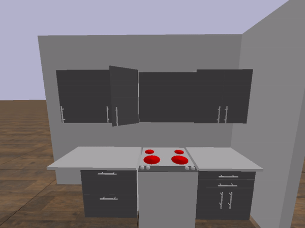

# pybullet_kitchen
A Pybullet simulation of a simple kitchen environment with articulated drawers

## Installation
To use this simulation, all you need to do is to install Pybullet using the command

`$ pip install pybullet`

## Usage
You can find a usage example in the `src/kitchen.py` file.

## Demo 

Opening and closing the kitchen drawers

